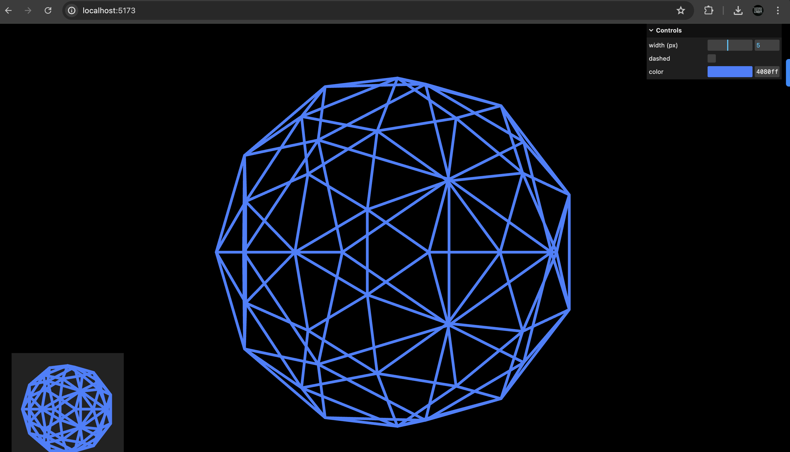

# Three.js Visualization Project

This project demonstrates the use of three.js for creating stunning 3D visualizations with features such as wireframes, multiple cameras, and interactive controls.

## Table of Contents
- [Introduction](#introduction)
- [Features](#features)
- [Project Structure](#project-structure)
- [Setup Instructions](#setup-instructions)
- [Usage](#usage)
- [Visualization](#visualization)
- [Dependencies](#dependencies)

## Introduction

This project showcases a 3D scene created using three.js, a powerful JavaScript library for 3D graphics. The scene includes an icosahedron (polyhedron with 20 faces) with a dynamic wireframe, multiple cameras, and interactive controls for an immersive experience.

### Dynamic Wireframes
Wireframes are an essential visualization technique in 3D graphics that allows you to see the underlying structure of 3D models. In this project, you can toggle between solid and dashed wireframes, providing a versatile way to view and analyze the geometry of the icosahedron. The line width and color of the wireframes can also be customized through a user-friendly graphical interface.

### Multiple Cameras
To enhance the visualization experience, this project uses multiple cameras. The main camera provides a comprehensive view of the 3D scene, while an inset camera offers an additional perspective. This dual-camera setup allows you to observe the 3D model from different angles simultaneously, making it easier to understand its structure and spatial relationships.

### Interactive Controls
Interactivity is a key feature of modern 3D graphics, and this project includes interactive controls using OrbitControls. These controls allow you to rotate, zoom, and pan the camera around the scene with ease, providing an intuitive way to explore the 3D model. The graphical user interface (GUI) further enhances interactivity by offering controls to adjust wireframe properties dynamically.


## Features

- **Dynamic Wireframes**: Toggle between solid and dashed wireframes.
- **Multiple Cameras**: Main camera and inset camera views.
- **Interactive Controls**: OrbitControls for camera manipulation.
- **Customizable GUI**: Adjust line width, toggle dashed lines, and change colors via a GUI.

## Project Structure

```
project-root/
│
├── src/
│   ├── main.js         # Main JavaScript file for three.js scene
│   └── index.css       # CSS for basic styling
│
├── index.html          # HTML file to load the three.js scene
└── README.md           # This README file
```

## Setup Instructions

### Prerequisites

Ensure you have the following installed:

- A modern web browser (Chrome, Firefox, etc.)
- A local server setup (e.g., Live Server extension for VSCode)

### Steps

1. Clone the repository:
   ```bash
   git clone <repository-url>
   cd <repository-folder>
   ```

2. Open `index.html` in your web browser using a local server.

## Usage

### Running the Project

1. Start your local server.
2. Open `index.html` in your web browser.
3. You should see a 3D scene with an icosahedron wireframe and a GUI for customization.

### GUI Controls

- **Width (px)**: Adjust the line width of the wireframe.
- **Dashed**: Toggle between solid and dashed lines.
- **Color**: Change the color of the wireframe.

## Visualization

### Main Scene
The main scene displays an icosahedron with dynamic wireframe options. The camera can be rotated and zoomed using the mouse.

### Inset Camera
An inset view provides an additional perspective of the scene, enhancing the visualization experience.

### Screenshots



## Dependencies

- [three.js](https://threejs.org/)
- [lil-gui](https://lil-gui.georgealways.com/)
- [OrbitControls](https://threejs.org/docs/#examples/en/controls/OrbitControls)
- [WireframeGeometry2](https://threejs.org/examples/jsm/lines/WireframeGeometry2.js)
- [LineMaterial](https://threejs.org/examples/jsm/lines/LineMaterial.js)

